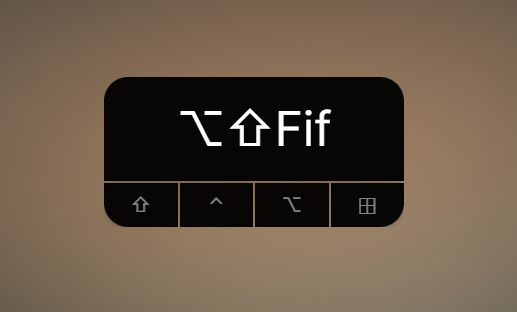

# Introduction

Keyread - an open source keystroke visualizer that inspired from KeyCastr



It enables you to share your keystroke when streaming your screen. And yes, it looks like KetCastr. 
The only difference is that it supports **Windows**. 

For now, it only provide one theme as the above image

## Demo

[](./docs/typing.mp4)

# Installation
### For Windows 
Download the latest version from [here](https://github.com/hudy9x/keyreader/releases)

Or, install using [scoop](https://scoop.sh/)
```shell
$ .... comming soon
```

### For Linux
For now, follow Development guide to build your own.


### For Mac
Please use [KeyCastr](https://github.com/keycastr/keycastr) instead

# Development
KeyReader is built on [Tauri](https://tauri.app/). So, please follow their [instruction](https://tauri.app/v1/guides/getting-started/prerequisites) for installing development environment

Second, you must have `nodejs`, `npm` or `yarn`

After installing all above dev tools. Open terminal and start developing

```shell
$ npm run devapp
```

For building

```shell
$ npm run tauri build
```

# Issues
Please visit [issues](https://github.com/hudy9x/keyreader/issues)
Feel free to fork and make a PR for me

Note: I'm a new to Rust, so please help me improve the source code. Big thanks for good explanation, i'd love to learn from you guys

# License
[BSD 3-Clause](https://opensource.org/licenses/BSD-3-Clause)

KeyCastr has been freely available for the Windows since 2023.
